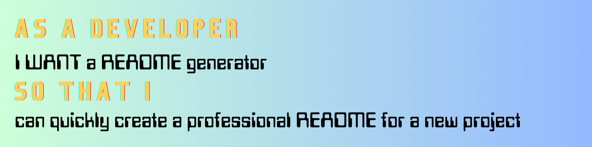
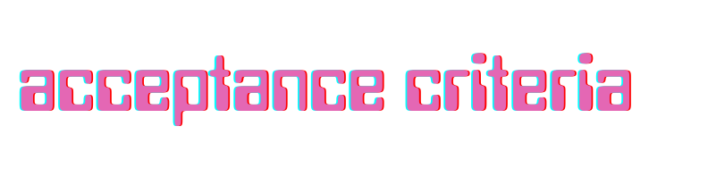
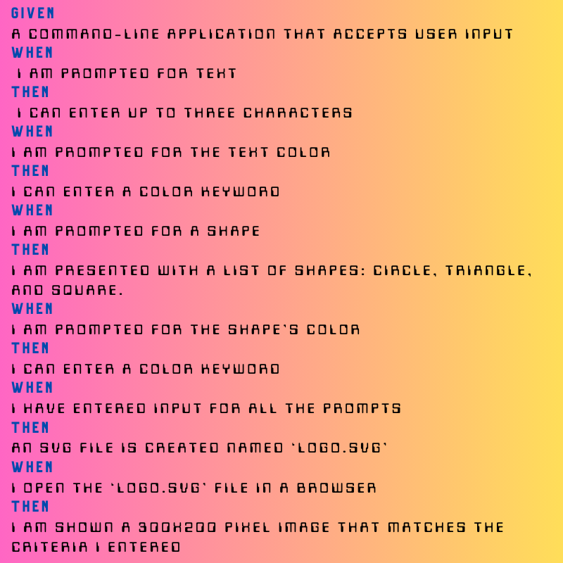
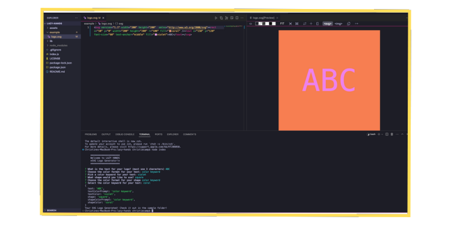

## 

  - [OVERVIEW](#overview)
    - [user story](#user-story)
    - [acceptance criteria](#acceptance-criteria)
    - [the lazy list](#lazy-list)
  - [INSTALLATION](#installation)
  - [USAGE](#usage)
    - [screenshot](#screenshot)
    - [demo](#demo)
  - [SOURCES](#sources)
  - [LICENSE](#license)
  - [LINKS](#links)
  - [CONNECT](#connect)
 

## 
The Lazy Hands LOGO Generator creates SVG logo files by using command-line applications.

This application dynamically generates a professional **SVG** file from a user’s input using the [Inquirer package]((https://www.npmjs.com/package/inquirer/v/8.2.4)).

### 

### 

### 

## 

The application was invoked using the following commands: 
- 

## 

**INSTRUCTIONS:**

1. Open the Integrated Terminal and input - **node index**.
2. Enter the title of your project.
3. Enter a short description for your project.
4. List the steps required to install your project.
5. Explain the project's usage, and provide any screenshot or demo of functionality.
6. Pick the license used for your project.
6. List the contributors for your project.
7. List any testing, if used, for your project.
8. Add your GitHub and email address.

### 

### The below screenshot demonstrates the command-line application and the resulting sample README.md that is produced.

### 

## 

### Here's a list of technologies used:

1. [Inquirer]((https://www.npmjs.com/package/inquirer/v/8.2.4)) - the NPM package that provides an easy way to capture user input in your Node. js command line interface applications. 

2. [Professional README Guide](https://coding-boot-camp.github.io/full-stack/github/professional-readme-guide) - a reminder of everything that a high-quality, professional README should contain.

3. [Node.js]() - is an open-source, cross-platform JavaScript runtime environment.

4. [Fullstack Blog Video Submission Guide](https://coding-boot-camp.github.io/full-stack/computer-literacy/video-submission-guide) - for additional guidance on creating a video.

## 

### [MIT License](./LICENSE)

## 

### [GitHub Repository](https://github.com/christiecamp/personal-slate)

### [Sample SVG](./example/logo.svg)

### [Video Walkthrough]()

## 
   ### Questions? Connect with me at: 
   ### GiHub: [christiecamp](https://github.com/christiecamp) 
   ### Email: christiecamphoto@gmail.com  
   
