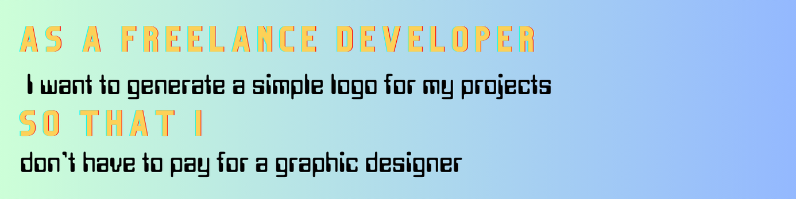

 

### 

  - [OVERVIEW](#overview)
    - [user story](#user-story)
    - [acceptance criteria](#acceptance-criteria)
    - [the lazy list](#lazy-list)
  - [INSTALLATION](#installation)
  - [USAGE](#usage)
    - [screenshot](#screenshot)
    - [demo](#demo)
  - [TESTING](#testing)
  - [SOURCES](#sources)
  - [LICENSE](#license)
  - [LINKS](#links)
  - [CONNECT](#connect)
 

### 
The Lazy Hands LOGO Generator creates SVG logo files by using a Node.js command-line application.

This application dynamically generates a professional **SVG** logo and saves it as an [SVG file](https://en.wikipedia.org/wiki/Scalable_Vector_Graphics).

### 

### 

### 

### 

The application was invoked using the following commands:

* node index.js
* npm init -y
* npm i inquirer@8.2.4
* npm i --save-dev jest
* npm test

### 

**INSTRUCTIONS:**

1. Open the Integrated Terminal and input - node index.
2. Enter the text for your SVG with the required text character limit (3).
3. Choose the format to pick the color for your text:
    * by provided color keywords
    * by inputting hexadecimal #
3. Choose the shape of your logo
    * circle
    * square
    * triangle
4. Choose the format to pick the color for your text:
    * by provided color keywords
    * by inputting hexadecimal #

### 

The below screenshot demonstrates the command-line application and the resulting sample SVG file that is produced.

### 

The included demo demonstrates the command-line application and testing of the resulting sample SVG file.

### Generating SVG

### Testing SVG

### 

Each shape class was tested for a **render() method** that returns a string for the corresponding SVG file with the given shape color.

### 

Here's a list of technologies used:

1. [Node.js]() - is an open-source, cross-platform JavaScript runtime environment.

2. [Inquirer]((https://www.npmjs.com/package/inquirer/v/8.2.4)) - the NPM package that provides an easy way to capture user input in your Node. js command line interface applications. 

3. [Jest](https://jestjs.io/) - JavaScript testing framework used for testing.

4. [Fullstack Blog Video Submission Guide](https://coding-boot-camp.github.io/full-stack/computer-literacy/video-submission-guide) - for additional guidance on creating a video.

### 

 [MIT License](./LICENSE)

### 

[GitHub Repository](https://github.com/christiecamp/lazy-hands)

[Sample SVG](./example/shapes/circle.svg)

[Video Walkthrough - Generate SVG](https://www.loom.com/share/6543c5d1e5ae49c39c4e1bf686a4fc34?sid=0d38749e-4729-4b95-8413-5d3d3c0870f7)

[Video Walkthrough - Testing SVG](https://www.loom.com/share/1c5d12a84723444da3099ace13f43acc?sid=4a55f020-0e20-4168-9110-416782f1e0cb)

## 
  Questions? Connect with me at: 
  GiHub: [christiecamp](https://github.com/christiecamp) 
  Email: christiecamphoto@gmail.com  
   
